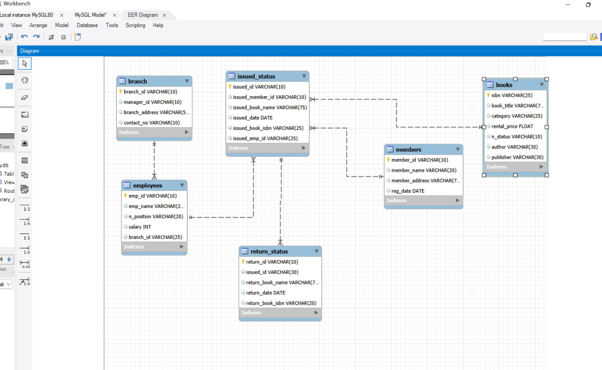

# Library-Management-System-using-MySQL-Project---P2
Project 2 of MySQL

# Project Overview

Project Title: Library Management System  
Level: Intermediate  
Database: library_db  

This project demonstrates the implementation of a Library Management System using SQL. It includes creating and managing tables, performing CRUD operations, and executing advanced SQL queries. The goal is to showcase skills in database design, manipulation, and querying.

# Objectives

1. Set up the Library Management System Database: Create and populate the database with tables for branches, employees, members, books, issued status, and return status. 
2. CRUD Operations: Perform Create, Read, Update, and Delete operations on the data. 
3. CTAS (Create Table As Select): Utilize CTAS to create new tables based on query results. 
4. Advanced SQL Queries: Develop complex queries to analyze and retrieve specific data.

# Project Structure

1. Database Setup

* Database Creation: Created a database named library_db.
* Table Creation: Created tables for branches, employees, members, books, issued status, and return status. Each table includes relevant columns and relationships.

2. CRUD Operations

* Create: Inserted sample records into the books table.
* Read: Retrieved and displayed data from various tables.
* Update: Updated records in the employees table.
* Delete: Removed records from the members table as needed.

3. CTAS (Create Table As Select)

* Create Summary Tables: Used CTAS to generate new tables based on query results - each book and total book_issued_cnt**

